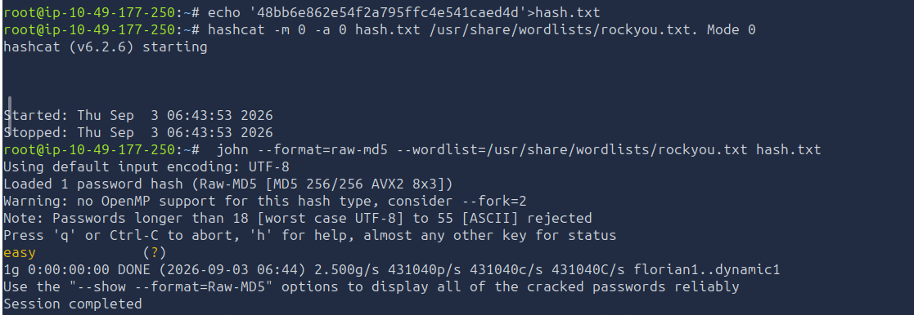
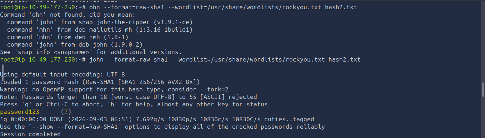
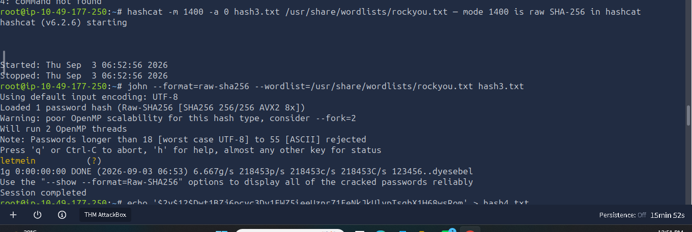
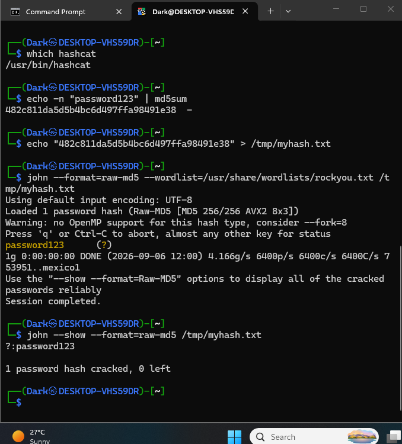
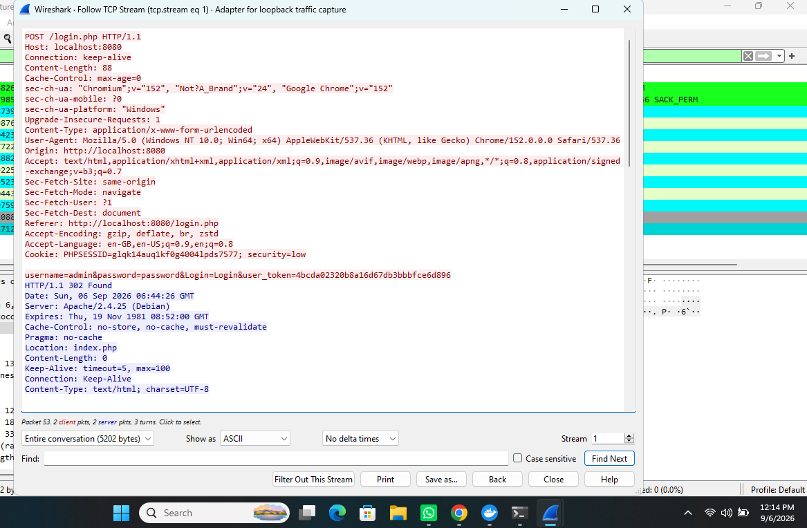

# Cryptographic Failures — Hash Identification & Offline Cracking

**OWASP Category:** A02:2021 – Cryptographic Failures
**Target:** Four password hashes of unknown type (CTF / TryHackMe-style challenge)
**Tools:** `hashcat`, John the Ripper (`john`), `rockyou.txt`

---

## 1. Overview

Cryptographic Failures cover any weakness in how sensitive data — most commonly passwords — is stored or transmitted. A system can have flawless input validation and still fail here if it hashes passwords with an algorithm that was never designed to resist offline brute-forcing.

This lab worked through four hashes of unknown type, with no information given up front except the raw hash string. The goal was to practice the full real-world workflow: identify the algorithm from the hash itself, choose the correct tool and mode, and actually recover the plaintext — then reason about *why* three of the four fell in seconds while the fourth was designed not to.

---

## 2. Environment

| Component | Details |
|---|---|
| Environment | Kali Linux (TryHackMe AttackBox) |
| Tools | `hashcat` v6.2.6, John the Ripper v1.9.x |
| Wordlist | `/usr/share/wordlists/rockyou.txt` |
| Hashes | 1x MD5, 1x SHA-1, 1x SHA-256, 1x bcrypt |

---

## 3. Step 1 — Identifying Hash Type by Format

No hash was labeled. Each type was identified purely from length (hex characters) or a distinguishing prefix, before any cracking attempt:

| Hash Type | Length | Distinguishing Feature |
|---|---|---|
| MD5 | 32 hex chars | Plain hex string, no prefix |
| SHA-1 | 40 hex chars | Plain hex string, no prefix |
| SHA-256 | 64 hex chars | Plain hex string, no prefix |
| bcrypt | ~60 chars | Starts with `$2y$`, `$2a$`, or `$2b$`, followed by a cost factor (e.g. `$2y$12$...`) |

Getting this step right matters more than it looks — supplying the wrong mode number or `--format` flag to hashcat/John guarantees failure even against the correct password, since the tool would be computing the wrong algorithm entirely.

---

## 4. Step 2 — Cracking Each Hash

### 4.1 MD5

```bash
echo '48bb6e862e54f2a795ffc4e541caed4d' > hash.txt
hashcat -m 0 -a 0 hash.txt /usr/share/wordlists/rockyou.txt
john --format=raw-md5 --wordlist=/usr/share/wordlists/rockyou.txt hash.txt
```

**Result:** cracked instantly — plaintext `easy`.


*John the Ripper cracking the MD5 hash in under a second (431,040 candidates/sec).*

### 4.2 SHA-1

```bash
echo 'CBFDAC6008F9CAB4083784CBD1874F76618D2A97' > hash2.txt
hashcat -m 100 -a 0 hash2.txt /usr/share/wordlists/rockyou.txt
john --format=raw-sha1 --wordlist=/usr/share/wordlists/rockyou.txt hash2.txt
```

**Result:** cracked instantly — plaintext `password123`.


*John the Ripper cracking the SHA-1 hash (10,830 candidates/sec, DONE in under a second).*

> **Troubleshooting note:** a typo (`ohn` instead of `john`) triggered a "command not found" suggestion from the shell before the correct command was re-run — a reminder that copy-pasting commands character-for-character matters.

### 4.3 SHA-256

```bash
echo '1C8BFE8F801D79745C4631D09FFF36C82AA37FC4CCE4FC946683D7B336B63032' > hash3.txt
hashcat -m 1400 -a 0 hash3.txt /usr/share/wordlists/rockyou.txt
john --format=raw-sha256 --wordlist=/usr/share/wordlists/rockyou.txt hash3.txt
```

**Result:** cracked instantly — plaintext `letmein`.


*John the Ripper cracking the SHA-256 hash (218,453 candidates/sec, DONE in under a second).*

> **Note:** hashcat's Started/Stopped timestamps were identical on this run — investigated as a possible silent failure, but John's parallel run confirmed the crack succeeded regardless of hashcat's outcome, underlining the value of trying both tools rather than trusting one silently.

### 4.4 bcrypt

```bash
echo '$2y$12$Dwt1BZj6pcyc3Dy1FWZ5ieeUznr71EeNkJkUlypTsgbX1H68wsRom' > hash4.txt
hashcat -m 3200 -a 0 hash4.txt /usr/share/wordlists/rockyou.txt
john --format=bcrypt --wordlist=/usr/share/wordlists/rockyou.txt hash4.txt --fork=4
```

**Result:** significantly slower than the three hashes above — did not complete instantly like MD5/SHA1/SHA256. John reported: *"Cost 1 (iteration count) is 4096 for all loaded hashes"*, confirming the deliberate per-guess slowdown baked into bcrypt.

**Troubleshooting encountered:**
- A session interruption produced `Session aborted` mid-crack; resumed via `john --restore` rather than restarting the wordlist from the beginning.
- A `syntax error near unexpected token '('` occurred from accidentally pasting explanatory text (a parenthetical aside) directly into the terminal alongside the real command — resolved by only ever pasting the literal command.

---

## 5. Why the Results Differed So Sharply

| Hash Type | Speed to Crack | Root Cause |
|---|---|---|
| MD5 | Instant (431K+ guesses/sec) | Fast general-purpose hash, no salt, no iteration — designed for speed, not security |
| SHA-1 | Instant (10K+ guesses/sec) | Same category as MD5 — cryptographically stronger digest, but still fast and unsalted |
| SHA-256 | Instant (218K+ guesses/sec) | Same category again — a *stronger* hash function is not the same as a *password-safe* one |
| bcrypt | Dramatically slower | Purpose-built for password storage: embeds a salt per-hash and applies a configurable cost factor (2^12 = 4096 rounds per guess here) |

**The core lesson:** hash strength and password-storage suitability are not the same axis. MD5, SHA-1, and SHA-256 are all *fine* hash functions for data integrity checks — but using any of them to store a password is a cryptographic failure, because their speed is exactly what makes offline cracking practical at scale. bcrypt (and similarly Argon2, scrypt) exist specifically to make each individual guess expensive, so that even a leaked hash database resists brute-forcing.

---

## 6. Impact & Fix

**Impact:** In a real breach, a leaked database of MD5 or SHA-1 password hashes can be cracked at hundreds of thousands of guesses per second per machine — meaning any password present in a common wordlist (like `rockyou.txt`, itself sourced from a real historical breach) is recovered in seconds, at zero cost to the attacker beyond compute time. All three plaintexts recovered here (`easy`, `password123`, `letmein`) are exactly the kind of weak, common passwords real breach datasets are dominated by.

**Fixes:**

| Finding | Fix |
|---|---|
| Passwords hashed with MD5/SHA-1/SHA-256 | Never use general-purpose hash functions for password storage |
| No salting | Use an algorithm that salts automatically per-password (bcrypt, Argon2, scrypt) |
| No cost/iteration factor | Use an adjustable-cost algorithm and tune the cost factor to the hardware available, increasing it over time as hardware gets faster |
| Weak user passwords | Enforce password complexity/length policies and check new passwords against known-breached password lists |

---

## 7. Extension — Live Application Test on DVWA (Salting & Encryption-in-Transit)

The CTF exercise above proved *offline* hash-cracking speed differences on isolated hashes with no application context. This extension re-tests the same underlying principles against a **live running application** (DVWA), adding two angles the CTF hashes alone couldn't show: **whether identical passwords produce identical hashes**, and **whether credentials are protected in transit**, not just at rest.

### 7.1 Salting — bcrypt vs. unsalted MD5, same password, two runs

Reused the DVWA admin password (`password`, cracked in the [Identification and Authentication Failures](../identification-authentication-failures) lab) to compare hashing behavior directly:

```bash
echo -n "password123" | md5sum
```
```
482c811da5d5b4bc6d497ffa98491e38  -
```

```bash
echo "482c811da5d5b4bc6d497ffa98491e38" > /tmp/myhash.txt
john --format=raw-md5 --wordlist=/usr/share/wordlists/rockyou.txt /tmp/myhash.txt
```
```
password123      (?)
1g 0:00:00:00 DONE (2026-09-06 12:00) 4.166g/s 6400p/s 6400c/s 6400C/s
```

**Result:** cracked in **0.00 seconds** — the same MD5 input always produces the same output, so once a password is in a wordlist, every account using it is broken instantly, with no per-password cost at all.


*Figure 4 — Locating rockyou.txt, confirming hashcat's presence, then cracking the unsalted MD5 hash of `password123` in 0.00 seconds via John the Ripper.*

Then the identical password was hashed twice with bcrypt:

```bash
python3 -c "import bcrypt; print(bcrypt.hashpw(b'password123', bcrypt.gensalt()))"
```
```
Run 1: $2b$12$KgwRlpRylfxENLPB1G5Dc.OCQ3CzpbDdGxH29X5tYG/Jm4wHAhrk2
Run 2: $2b$12$CsmqRNsSh0j445SIc0oys.cULdg.Kz0urUzYVUbRD6b.inTMQ0RUS
```

**Result:** two completely different hash strings for the exact same password. bcrypt embeds a fresh random salt directly inside every hash it generates (`$2b$` = algorithm, `12` = cost factor / 2^12 rounds, followed by the unique salt) — so two users with identical passwords never produce matching hashes in the database, and a precomputed rainbow table becomes useless.

### 7.2 Encryption in Transit — capturing a live DVWA login in Wireshark

DVWA is served over plain `http://localhost:8080`, not HTTPS. A Wireshark capture on the loopback adapter (filtered to `tcp.port==8080`), followed by **Follow → TCP Stream** on the login POST request, showed the entire request body in readable ASCII:

```
POST /login.php HTTP/1.1
Host: localhost:8080
Cookie: PHPSESSID=glqk14auq1kf0g4004lpds7577; security=low

username=admin&password=password&Login=Login&user_token=4bcda02320b8a16d67db3bbbfce6d896
```


*Figure 5 — Full TCP stream of a DVWA login request: both the plaintext password and the live `PHPSESSID` session cookie are visible with zero decryption required.*

**Result:** the password (`password`) and, just as significantly, the live `PHPSESSID` session cookie are both fully readable. This means an attacker positioned to capture this traffic (shared Wi-Fi, a compromised router, a MITM position) doesn't even need to crack anything — they can lift the session cookie directly and hijack the session immediately, the same outcome as the [session fixation](../identification-authentication-failures) attack, reached here via a completely different route: no application logic exploited, just the total absence of transport encryption.

### 7.3 Why This Matters Beyond the Original CTF Hashes

| Test | What It Proves |
|---|---|
| Same password, MD5 twice | Deterministic, unsalted hashing means identical inputs are always identical outputs — the core weakness a rainbow table exploits |
| Same password, bcrypt twice | A properly designed password hash embeds a random salt per call, so identical passwords never look identical in storage |
| Live login captured in Wireshark | Cryptographic failure isn't only about hashing at rest — data in transit needs its own protection (TLS/HTTPS), independent of how well passwords are stored server-side |

**Updated core lesson:** A02 has two independent halves that both have to be solved — protecting data **at rest** (salted, slow hashing) and protecting data **in transit** (TLS). This DVWA test demonstrated a real application failing at both simultaneously: unsalted fast hashing server-side, and zero encryption on the wire.

---

## 8. Real-World Relevance

- OWASP lists Cryptographic Failures as one of the most consistently impactful categories precisely because the fix is well understood (use bcrypt/Argon2/scrypt) yet legacy systems using MD5/SHA-1 for passwords are still found in real audits and breaches today.
- `rockyou.txt` itself is not a synthetic list — it's derived from an actual 2009 data breach, which is why real-world weak passwords crack so reliably against it.
- This lab is a direct, hands-on demonstration of why "is it a strong hash function" and "is it safe for password storage" are two different questions — a distinction that matters both offensively (deciding if cracking a captured hash is worth attempting) and defensively (choosing what to implement in a system you're building).
- Connects directly to the earlier [SQL Injection write-up](../sql-injection), where a real MD5 password hash was extracted from a database via UNION-based injection and then cracked using this same methodology.
