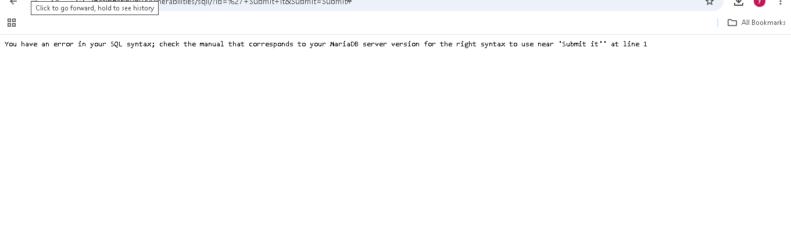

# Security Misconfiguration — DVWA (Low Security)

**OWASP Category:** A05:2021 – Security Misconfiguration
**Target:** DVWA's default setup, PHP Info page, SQL Injection module's error output, and raw HTTP headers
**Security Level Tested:** Low

---

## 1. Overview

Security Misconfiguration isn't one specific coding flaw like SQL Injection or XSS — it's a catch-all category for insecure settings that were never hardened. Where SQLi and XSS are bugs in *what the code does*, misconfiguration is a problem in *how the application and server were set up*: default credentials never changed, debug information left exposed, verbose errors shown to users, outdated software left running, or protective HTTP headers never configured.

This lab identified four separate, real misconfigurations in a single DVWA instance — none of which required any clever exploitation technique, only noticing what had been left exposed.

---

## 2. Environment

| Component | Details |
|---|---|
| Target | DVWA (Damn Vulnerable Web Application) |
| Deployment | Docker (`vulnerables/web-dvwa`), `localhost:8080` |
| Tools | Browser, `curl`, DVWA's built-in "PHP Info" page |

---

## 3. Steps to Reproduce

### 3.1 Default credentials

DVWA's login itself is the first misconfiguration: `admin` / `password`, the documented default, was never changed. In a real deployment, unchanged default credentials are one of the most common ways attackers gain an initial foothold — no exploit code required, just trying the obvious.

### 3.2 Exposed debug information — PHP Info page

DVWA ships a "PHP Info" link in its sidebar that runs PHP's `phpinfo()` function, dumping the full server configuration:

```
PHP Version 7.0.30-0+deb9u1
System                  Linux 3cc1d3d41339 6.18.33.2-microsoft-standard-WSL2 ...
Server API              Apache 2.0 Handler
Configuration File (php.ini) Path    /etc/php/7.0/apache2
Loaded Configuration File            /etc/php/7.0/apache2/php.ini
```

This confirms the exact PHP version, internal file paths, and server environment — information a real production application should never expose to an anonymous visitor.

### 3.3 Verbose error messages

With security set to Low, submitting a single quote (`'`) into the SQL Injection module's User ID field produced a raw, unhandled database error directly on the page:

```
You have an error in your SQL syntax; check the manual that corresponds to your MariaDB
server version for the right syntax to use near ''Submit it'' at line 1
```


*The unhandled database error, dumped directly onto the page after submitting a single quote.*

This single error message discloses the exact database engine (MariaDB), confirms the application performs no input sanitization before the query executes, and gives immediate feedback on whether an injected payload broke the query — turning exploitation from a blind guessing exercise into a guided one.

### 3.4 Missing security headers, revealed via `curl`

```bash
curl -I http://127.0.0.1:8080
```

**Result:**

```
HTTP/1.1 302 Found
Date: Wed, 02 Sep 2026 09:42:24 GMT
Server: Apache/2.4.25 (Debian)
Set-Cookie: PHPSESSID=1vunu0aaivgc4iqqr5u0mq0e95; path=/
Set-Cookie: security=low
Location: login.php
Content-Type: text/html; charset=UTF-8
```

Two separate problems in this one response:

- **`Server: Apache/2.4.25 (Debian)`** — discloses the exact web server version, giving an attacker a precise target to search for known CVEs against.
- **No security headers at all** — `Content-Security-Policy`, `X-Frame-Options`, and `Strict-Transport-Security` are all absent. Their absence is itself the finding.
- **`Set-Cookie: PHPSESSID=...`** has no `HttpOnly` or `Secure` flag attached.

> **Troubleshooting note:** `curl -I http://localhost:8080` initially hung indefinitely with no output or error. Switching to the explicit IPv4 address (`curl -I http://127.0.0.1:8080`) resolved it immediately — `localhost` was very likely attempting IPv6 resolution first with nothing listening on that path, the same category of IPv4/IPv6 binding issue encountered earlier in the networking fundamentals lab.

---

## 4. Why It Worked

None of these four findings required bypassing any defense — each one is something that was simply never configured correctly in the first place:

| Finding | Root cause |
|---|---|
| Default credentials | Installer/deployment never enforced a password change |
| PHP Info exposed | A debugging tool left reachable in what should be a production-like environment |
| Verbose SQL errors | `display_errors` (or equivalent) left enabled, and errors shown to the user instead of only logged server-side |
| Missing security headers | Headers were simply never set at the Apache/application level |

**The connecting thread:** misconfiguration findings rarely stand alone — they amplify other vulnerabilities. The verbose SQL error is what turned the earlier SQL Injection lab from blind guessing into guided, error-based exploitation. The missing `HttpOnly` flag on `PHPSESSID` is the exact gap that let the `document.cookie` payload in the XSS lab successfully read the live session cookie. A misconfiguration audit is often what explains *why* an otherwise "medium" bug becomes fully exploitable.

---

## 5. Impact & Fix

**Impact:** Individually, some of these findings look minor. Together, they reveal a full attack-enabling picture: an attacker can fingerprint the exact software stack (Apache 2.4.25, PHP 7.0.30, MariaDB), confirm the database engine and lack of input sanitization from error text alone, and exploit a missing `HttpOnly` flag to steal session cookies via XSS.

The most severe individual finding: **PHP 7.0 reached official end-of-life in January 2019** — this server has been running unpatched, unsupported software for years. Any PHP vulnerability disclosed since 2019 affects this installation and will never receive an official patch. This is exactly the class of finding real vulnerability scanners (Nessus, OpenVAS) flag as **Critical** severity.

**Fixes:**

| Finding | Fix |
|---|---|
| Default credentials | Enforce a mandatory password change on first login; never ship with a static default in production |
| PHP Info exposed | Remove or restrict access to any `phpinfo()` endpoint before deploying to production |
| Verbose errors | Set `display_errors = Off` in `php.ini`; log real errors server-side only, show generic messages to users |
| Missing security headers | Explicitly configure `Content-Security-Policy`, `X-Frame-Options`, `Strict-Transport-Security`, and `HttpOnly`/`Secure` flags on all cookies |
| Outdated PHP version | Upgrade to a currently supported PHP release and establish a patching cadence — never let production software silently age past its support window |

---

## 6. Real-World Relevance

- Security Misconfiguration is consistently one of the most common findings in real penetration tests, precisely because it requires no advanced technique — only noticing what was left exposed by default.
- Running end-of-life software is a leading cause of real breaches; once a version stops receiving patches, every newly disclosed vulnerability in it remains permanently exploitable.
- Missing security headers are routinely flagged by automated scanners (e.g. Mozilla Observatory, securityheaders.com) as one of the fastest, lowest-effort checks a defender can run against their own infrastructure.
- This lab is a direct illustration of why misconfiguration is graded as its own OWASP Top 10 category: it doesn't introduce a new attack technique so much as remove the friction that would otherwise limit other vulnerabilities.

