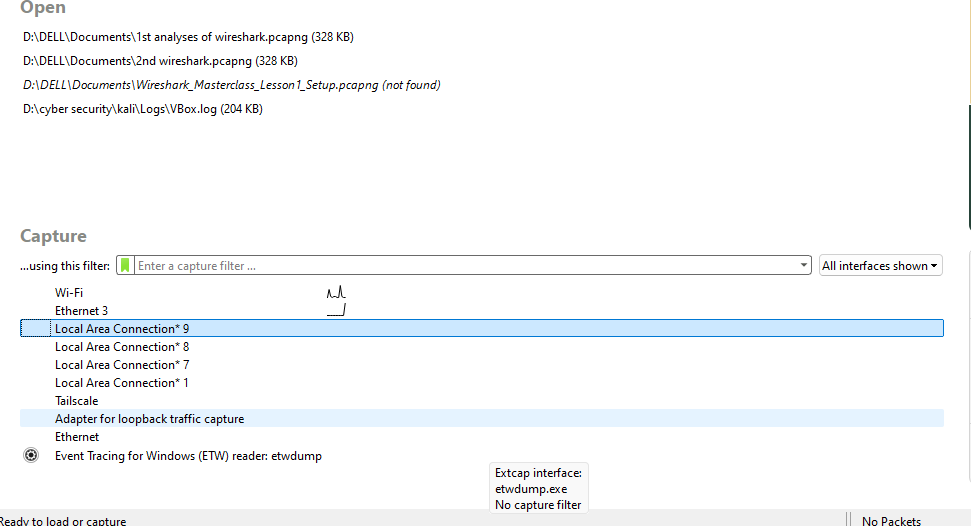
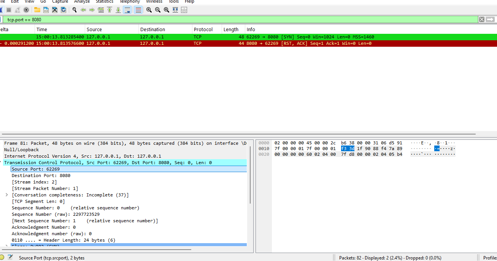

# Network Traffic Analysis & Service Fingerprinting — Wireshark + Nmap

**Category:** Networking Fundamentals (prerequisite skill for vulnerability assessment)
**Target:** A local Python HTTP server on `localhost:8080` — self-testing only
**Scope:** Own device only, no external or unauthorized scanning

---

## 1. Overview

Before touching real vulnerability scanning, this session focused on the fundamentals underneath it: capturing traffic with Wireshark, reading a TCP handshake correctly, and using Nmap to identify what's actually running on a port. This is the prerequisite skill set for judging whether something found later in an assessment is normal or a genuine issue.

---

## 2. Environment

| Component | Details |
|---|---|
| OS | Windows 10/11 |
| Tools | Wireshark, Npcap, Nmap, Python 3 (built-in `http.server`) |
| Target | `127.0.0.1` (own machine only) |

---

## 3. Steps to Reproduce

### 3.1 Setting up a controllable target

Started a local HTTP server to have a real, known service to scan against:

```bash
python -m http.server 8080
```

Initial output showed `Serving HTTP on :: port 8080` — the `::` meant it had bound to the IPv6 any-address, not IPv4. This caused a mismatch later since the capture and scan both targeted `127.0.0.1`. Fixed by binding explicitly:

```bash
python -m http.server 8080 --bind 127.0.0.1
```

### 3.2 Capturing traffic and reading the handshake

Captured on the Npcap loopback interface with the filter:

```
tcp.port == 8080
```


*Locating the "Adapter for loopback traffic capture" interface — this wasn't labeled "Npcap Loopback Adapter" as expected, which caused initial confusion (see Section 5).*

**Before the IPv4 fix** — a single SYN met with an immediate RST,ACK and no completed handshake (the closed-port pattern):

```
62269 → 8080 [SYN] Seq=0 Win=1024 Len=0
8080 → 62269 [RST, ACK] Seq=1 Ack=1 Win=0 Len=0
```


*The closed-port / failed-handshake pattern, captured before the IPv4 binding fix was applied.*

**After the fix** — a full 3-way handshake observed:

```
Client → Server [SYN]
Server → Client [SYN, ACK]
Client → Server [ACK]
... followed by HTTP request/response data
```

### 3.3 Service version detection with Nmap

```bash
nmap -sV -p 8080 127.0.0.1
```

**Result:**

```
PORT     STATE SERVICE VERSION
8080/tcp open  http    SimpleHTTPServer 0.6 (Python 3.x)
```

Unlike a basic scan (open/closed only), `-sV` actively probes the port and reads the service's self-reported identity.

### 3.4 Verifying the fingerprint at the packet level

Ran a fresh capture during the `-sV` scan, then right-clicked a data packet → **Follow → HTTP Stream**:

```
HTTP/1.1 200 OK
Server: SimpleHTTP/0.6 Python/3.x.x
```

This matched exactly what Nmap reported — confirming that `-sV` isn't "magic": it sends a real request and reads the same `Server:` banner visible directly in the packet capture.

---

## 4. Why This Matters (Analysis Framework)

The core question addressed: **how do you tell if something found in a capture is normal or a real problem?**

| Question | How to check | Result in this session |
|---|---|---|
| Is this port expected to be open? | Compare against a known baseline of what you intentionally run | Port 8080 was open because the Python server was deliberately started |
| What exactly is running on it? | `nmap -sV`, or inspect banners/headers manually | Identified as SimpleHTTP/0.6, Python 3.x |
| Is sensitive data exposed in plaintext? | Follow the TCP/HTTP stream, check for credentials or tokens | Only default HTML content served — nothing sensitive |
| Does the version have known vulnerabilities? | Cross-reference against NVD / CVE Details | Not yet performed — identified as the logical next step |
| Is the traffic pattern itself suspicious? | Look for high-volume SYNs to sequential ports with no completed handshakes | Not observed — traffic was a single controlled scan |

**Conclusion:** no actual vulnerability was present here — this was a controlled self-scan of a known service. The value was in learning to read and verify traffic patterns correctly, which is the prerequisite skill for real vulnerability assessment work.

---

## 5. Key Takeaways

- Command-line tools on Windows aren't automatically globally accessible — PATH configuration is a recurring, foundational troubleshooting step (hit with both Nmap and Python during this session).
- Tool naming can change across versions (Npcap's loopback interface wasn't labeled as expected) — worth checking for renamed equivalents before assuming something failed to install.
- A completed 3-way handshake (SYN → SYN,ACK → ACK) confirms a service is genuinely listening and reachable; an immediate RST,ACK after a lone SYN means the port is closed. This is the single most important pattern for reading any TCP-based capture.
- Automated tool output (like Nmap's `-sV`) can and should be manually verified at the raw packet level — this builds real understanding of what the tool is doing, rather than trusting it blindly.

